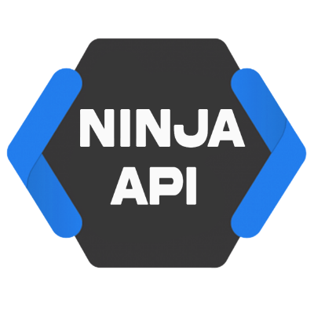

<h1 align="center">
    NinjaAPIs PHP Telegram Bots 
     
    
     
</h1>

A PHP Telegram Bot Open-Source Manager for [**NinjaAPIs**](https://ninja-apis.cf)

## Table of Contents
- [Introduction](#introduction)
- [Examples](#examples)
    - [Bin Lookup Bot](https://github.com/NinjaAPIs/Telegram-PHP-Bots/tree/main/Bin-Lookup%20Bot)
    - [IBAN Checker Bot](https://github.com/NinjaAPIs/Telegram-PHP-Bots/tree/main/IBAN%20Checker%20Bot)
    - [Voot Downloader Bot](https://github.com/NinjaAPIs/Telegram-PHP-Bots/tree/main/Voot%20Downloader%20Bot)
    - [JioSaavn Downloader Bot](https://github.com/NinjaAPIs/Telegram-PHP-Bots/tree/main/JioSaavn%20Downloader%20Bot)
    - [Mail Validator Bot](https://github.com/NinjaAPIs/Telegram-PHP-Bots/tree/main/Mail%20Validator%20Bot)
    - [Random Data Generator Bot](https://github.com/NinjaAPIs/Telegram-PHP-Bots/tree/main/Random%20Data%20Generator%20Bot)
- [Donate](#donate)
- [License](#license)
- [Credits](#credits)

## Introduction

This is a pure PHP Telegram Bot, fully extensible via plugins.

This repository aims to demonstrate the usage of all the features offered by the NinjaAPIs library and as such contains all example bots.
Also, it is based on the official [Telegram Bot API](https://core.telegram.org/bots/api) and doesn't use any external libraries

**:exclamation: Important!**
- The Bot Scripts found here are **not to be used exactly as they are**, they are mere demonstrations of features! They are provided as-is and any **extra security measures or features needs to be added by you**, the developer.
- Do **NOT** just copy all of them to your bot, but instead learn from them and only add to your bot what you need.
- Before getting started with this project, make sure you have read the official [documentation](https://ninja-apis.cf) to understand how these bots work.

Let's get started then! :smiley:

## Examples

- **[Bin Lookup Bot](https://github.com/NinjaAPIs/Telegram-PHP-Bots/tree/main/Bin-Lookup%20Bot)** - Provides Info about the Bin Given using [`Bin-Lookup API`](https://ninja-apis.cf/#bin-lookup)
- **[IBAN Checker Bot](https://github.com/NinjaAPIs/Telegram-PHP-Bots/tree/main/IBAN%20Checker%20Bot)** - Checks if the provided IBAN is valid or invalid using [`IBAN-Checker API`](https://ninja-apis.cf/#iban-checker)
- **[Voot Downloader Bot](https://github.com/NinjaAPIs/Telegram-PHP-Bots/tree/main/Voot%20Downloader%20Bot)** - Provides a Downloadable Link to the Given Movies/Series using [`Voot Downloader API`](https://ninja-apis.cf/#voot-downloader)
- **[JioSaavn Downloader Bot](https://github.com/NinjaAPIs/Telegram-PHP-Bots/tree/main/JioSaavn%20Downloader%20Bot)** - Provides a Downloadable Link to the Given Song using [`JioSaavn Downloader API`](https://ninja-apis.cf/#jiosaavn-downloader)
- **[Mail Validator Bot](https://github.com/NinjaAPIs/Telegram-PHP-Bots/tree/main/Mail%20Validator%20Bot)** - Checks if the provided Email is valid and if it exists using [`Mail Validator API`](https://ninja-apis.cf/#mail-validator)
- **[Random Data Generator Bot](https://github.com/NinjaAPIs/Telegram-PHP-Bots/tree/main/Random%20Data%20Generator%20Bot)** - Generates Information of a fake citizen using [`Random Data Generator API`](https://ninja-apis.cf/#random-data)

## Donate

All work on this Project consists of many hours of coding during our free time, to provide you with a Free API library that is easy to use.
If you enjoy using this library and would like to say thank you, donations are a great way to show your support.

Donations are invested back into the project :+1:

Thank you for keeping this project alive :pray:
- [[Bitcoin] 33bPBnGsQtiBCBoWeqfuPCnYpbAbArBWoH](https://www.blockchain.com/btc/address/33bPBnGsQtiBCBoWeqfuPCnYpbAbArBWoH)
- [ 0x873dD6717e8Cb52eC41454C790d0ae85Fbb51cdE](https://etherscan.io/address/0x873dD6717e8Cb52eC41454C790d0ae85Fbb51cdE)

## License
  

**[Telegram-PHP-Bots](https://github.com/NinjaAPIs/Telegram-PHP-Bots) is a Open Source Project for [NinjaAPIs](https://ninja-apis.cf) Under The Terms And Conditions Of The MIT License**

You can use, study share and improve it at your will. Permission is hereby granted, free of charge, to any person obtaining a copy of this software and associated documentation files, to deal in the Software without restriction, including without limitation the rights to use, copy, modify, merge, publish, distribute, sublicense, and/or sell copies of the Software, and to permit persons to whom the Software is furnished to do so, subject to the following conditions
